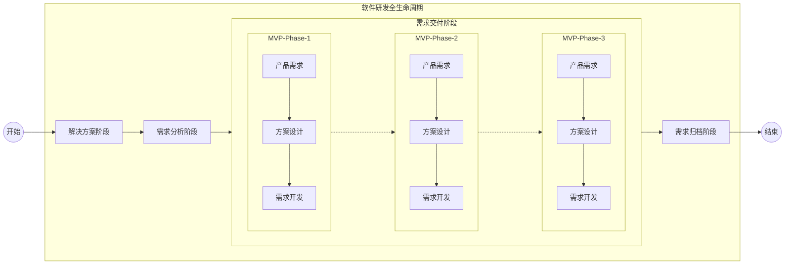

# AI SDD 软件研发与变更管理 AGENT 指南

## 1 指南定位

本指南是一套完整的 AI Agent 驱动的软件研发与变更管理方法论，旨在通过 Multi-Agent 协作工作流，全面赋能业务逻辑极其复杂、需求频繁变更的分布式软件系统研发全生命周期。

## 2 核心理念

**SDD（Specification-Driven Development，规约驱动开发）**：以规范化的文档规约为核心驱动力，所有研发活动围绕结构化规约展开，AI Agent 既是规约的生产者，也是规约的消费者和执行者。

**OpenSpec 规范**：一套开放的、可机器解析的规约格式标准，确保 AI Agent 能够精准理解、生成和验证各类研发产物。

## 3 适用场景

- 业务逻辑极其复杂的分布式系统（微服务架构、事件驱动架构）
- 需求频繁变更、迭代节奏快的产品研发
- 多团队协作、跨领域集成的大型软件工程
- 存量系统的持续演进与现代化改造

## 4 工作流全景

**工作流设定**：

- 解决方案阶段：利用AI从海量/模糊的业务描述中提取结构化需求，结合现存系统说明文档，评估业务影响面，识别潜在的业务冲突，确立业务目标和解决思路，输出解决方案文档
- 需求分析阶段：基于解决方案和系统说明文档，利用AI深度研究、探索，提出具体的需求分析，拆分需求为多个MVP阶段，输出需求分析文档
- 需求交付阶段：将需求分析各个MVP阶段的需求，以需求研发的形式，开展产品需求设计、技术方案设计，产出需求规约，采用SDD的规范开发，逐个交付
  - 产品需求阶段：利用AI辅助产品方案和功能设计，包括业务流程、用户故事、用例图、功能模块、用户交互设计、业务规则等，输出产品需求文档
  - 方案设计阶段：利用AI辅助技术方案设计（领域驱动设计、微服务拆分及分布式架构选型）、测试方案设计，输出技术方案文档、测试方案文档，并按服务组织需求规约
  - 需求开发阶段：基于服务需求规约，按照SDD的规范，投入开发、交付上线需求
- 需求归档阶段：每个需求交付后，利用AI自动生成需求变更记录，更新需求变更文档，自动生成并维护动态更新的产品文档、架构文档、API文档和测试文档

---

## 5 参考规范

- 文档库使用指南参考`docs/README.md`
- 解决方案规范参考`.ai/prompts/solutions/README.md`
- 需求分析规范参考`.ai/prompts/analysis/README.md`
- 需求交付规范参考`.ai/prompts/requirements/README.md`
- 系统说明文档规范参考`.ai/prompts/instructions/README.md`
- 开发规范参考 `.ai/rules/*`
