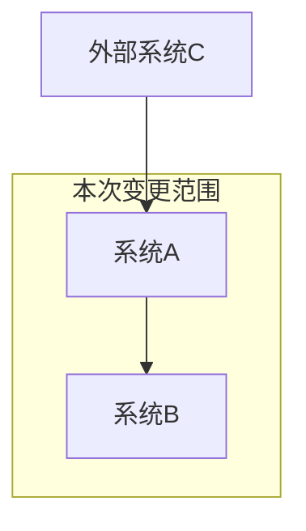
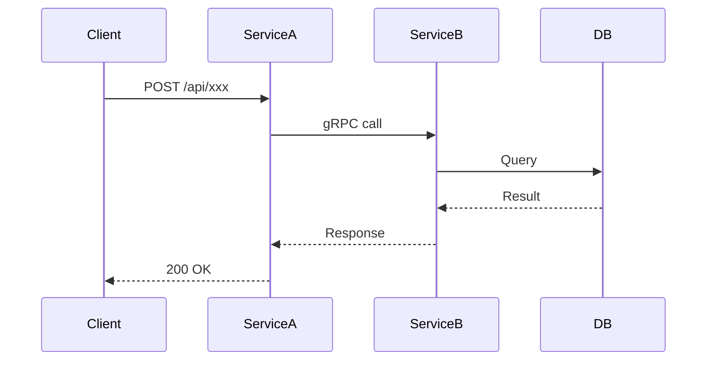
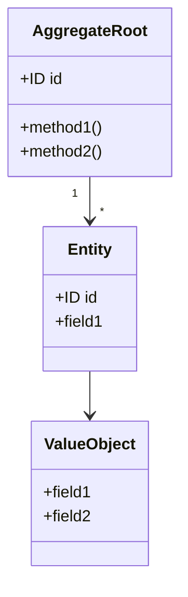
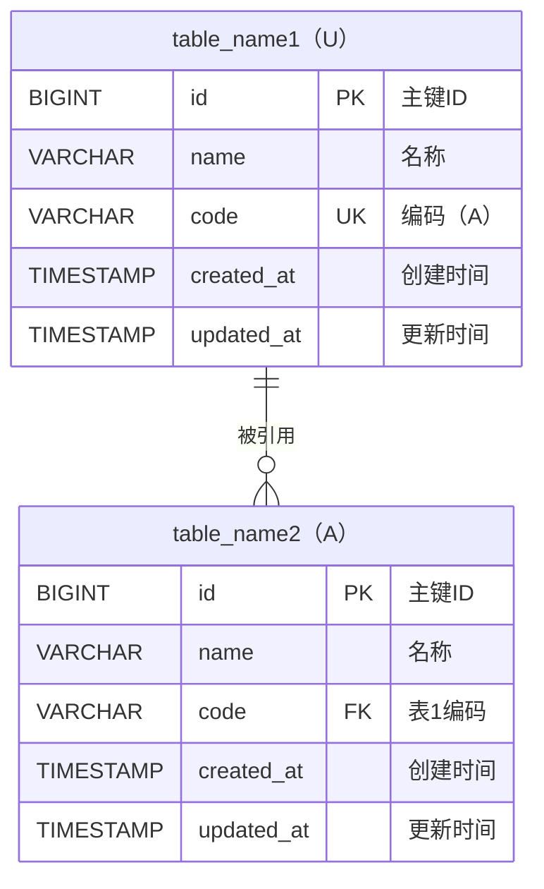
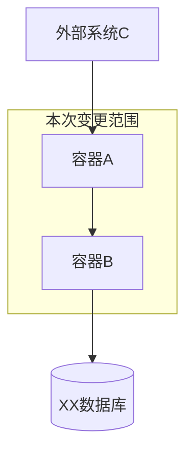
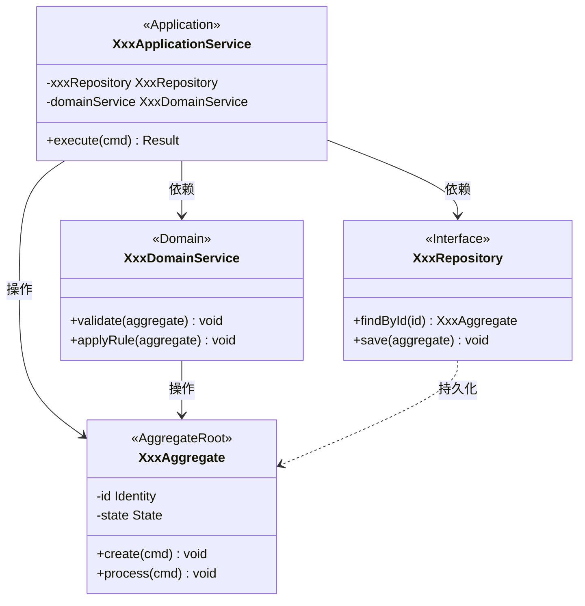
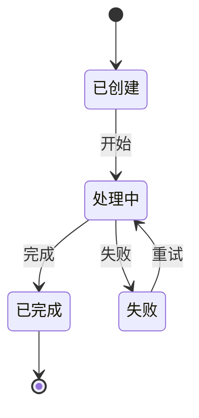
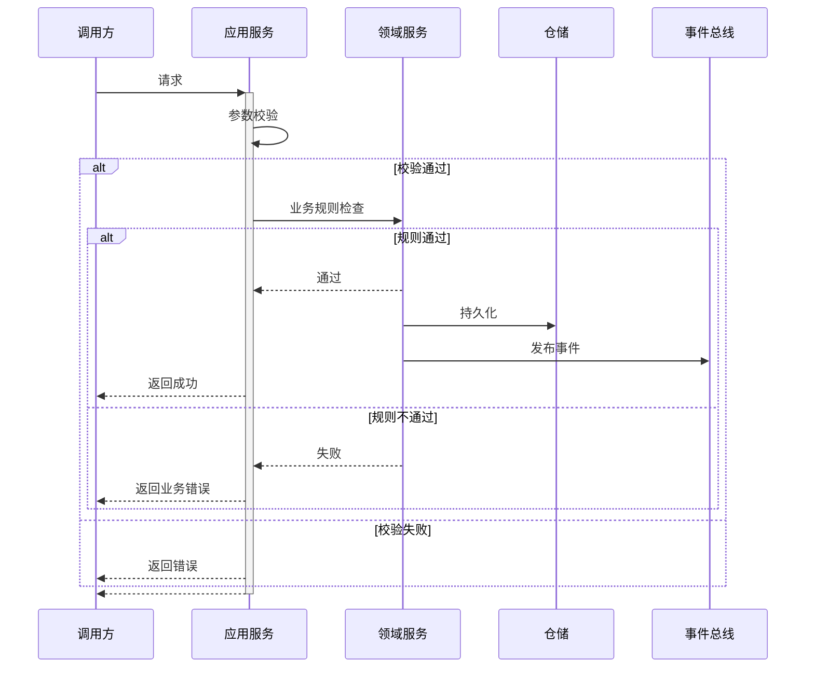

---

# {架构设计标题}

## 1. 设计概述

### 1.1 设计目标

- 关联需求分析：`analysis/REQUIREMENT-{ID}.md`
- 关联产品需求：`docs/requirements/REQUIREMENT-{ID}/MVP-{N}/PRD-{ID}.md`
- MVP阶段：MVP-{N}

### 1.2 设计约束
<!-- 技术约束、架构约束、兼容性约束等 -->

### 1.3 关键设计决策

| 决策编号 | 决策点 | 决策结果 | 决策理由 | 备选方案 |
| --------- | ------- | --------- | --------- | --------- |
| DD-001 | | | | |

## 2. 架构设计

### 2.1 系统架构设计

#### 系统架构图



#### 服务变更

| 服务名称  | 变更类型 | 变更说明    |
| --------- | -------- | ----------- |
| service-a | 变更     | 新增xxx功能 |
| service-b | 新增     | 新服务      |

#### 服务交互



### 2.2 接口协议设计

| 接口名称 | 所属服务 | 能力说明 | 输入输出 |
| --------------- | -------- | -------- | ------ |
| XX接口 | serivice-a | 提供XX能力 | 输入：XX <br/> 输出：YY |

### 2.3 领域模型设计

#### 领域模型图



#### 领域事件

| 事件名称        | 触发条件 | 携带数据 | 消费者 |
| --------------- | -------- | -------- | ------ |
| XxxCreatedEvent |          |          |        |

### 2.4 数据架构设计

#### 数据库表设计



#### 数据分片设计

#### 数据迁移方案

### 2.5 发布方案设计

#### 发布步骤
<!-- 明确本次变更涉及的部署与环境变更，按顺序列出操作项（例如：容器/服务升级、数据库迁移、配置/环境变量调整、接口切换等） -->

#### 发布检查

- 变更窗口与影响面通知到位
- 相关服务和依赖是否已完成升级/发布准备
- 回滚/兜底策略是否有预案
- 数据迁移是否有验证脚本
- 三方验证、全链路验证是否已准备好
  
#### 回滚方案

- 回滚前需备份相关数据库与配置
- 回滚步骤：逐步逆向操作（如数据库还原、容器回滚等），确保服务健康
- 回滚注意事项：做好监控收敛，通知相关人员

## 3. 详细设计

### 3.1 应用架构设计

> 跟外部系统集成的关系，消息队列、异步处理机制，用到的容器



### 3.2 API详细设计

#### API-001：{API名称}

- 能力描述：提供XX能力

**API签名** ：

```text
`POST /api/v1/xxx`
```

**请求参数** :

```json
{
  "field1": "string, required, 描述",
  "field2": "integer, optional, 描述"
}
```

**响应结构**：

```json
{
  "code": 0,
  "message": "success",
  "module": {
    "id": "string",
    "field1": "string"
  }
}
```

**错误码**：

| 错误码 | 错误信息 | 触发条件 | HTTP状态码 |
| ------ | -------- | -------- | ---------- |
| 40001  |          |          | 400        |

**幂等性**：
<!-- 描述幂等性保障方案 -->

### 3.3 业务逻辑设计

#### 核心类图



> 按实际 MVP 补充：应用服务、领域服务、聚合根/实体及仓储接口，并标注依赖与职责。

#### 状态机设计



#### 逻辑-001: {逻辑名称}

**流程图**：



**伪代码**：

```python
function processXxx(request):
    // 1. 参数校验
    validate(request)
    
    // 2. 业务规则检查
    checkBusinessRules(request)
    
    // 3. 执行业务逻辑
    result = executeLogic(request)
    
    // 4. 持久化
    save(result)
    
    // 5. 发布领域事件
    publishEvent(XxxCreatedEvent(result))
    
    return result
```

#### 一致性设计
<!-- 乐观锁/悲观锁/分布式锁方案 -->
<!-- 本地事务/分布式事务/最终一致性方案 -->

### 3.4 数据访问设计

#### 库表DDL

```sql
-- 创建主表
CREATE TABLE table_name1 (
    id BIGINT PRIMARY KEY COMMENT '主键ID',
    name VARCHAR(64) NOT NULL COMMENT '名称',
    code VARCHAR(32) UNIQUE NOT NULL COMMENT '编码（A）',
    created_at TIMESTAMP DEFAULT CURRENT_TIMESTAMP COMMENT '创建时间',
    updated_at TIMESTAMP DEFAULT CURRENT_TIMESTAMP ON UPDATE CURRENT_TIMESTAMP COMMENT '更新时间'
);

-- 创建附属表
CREATE TABLE table_name2 (
    id BIGINT PRIMARY KEY COMMENT '主键ID',
    name VARCHAR(64) NOT NULL COMMENT '名称',
    code VARCHAR(32) NOT NULL COMMENT '表1编码',
    created_at TIMESTAMP DEFAULT CURRENT_TIMESTAMP COMMENT '创建时间',
    updated_at TIMESTAMP DEFAULT CURRENT_TIMESTAMP ON UPDATE CURRENT_TIMESTAMP COMMENT '更新时间',
    CONSTRAINT fk_code FOREIGN KEY (code) REFERENCES table_name1(code)
);
```

#### 查询策略

**索引策略**

```sql
-- 索引
CREATE INDEX idx_table_name1_name ON table_name1(name);
CREATE INDEX idx_table_name2_name ON table_name2(name);
```

- 常用查询字段建议添加二级索引，如 `name`、`code`。
- 联合索引可依据实际查询场景补充设计，避免冗余。

**分页策略**

- 推荐使用主键/唯一索引进行物理分页（如 `where id > ? order by id limit ?`）。
- 大数据量场景下避免 offset 过大的 SQL。

#### 缓存策略

| 缓存Key模式               | 数据类型    | 过期时间 | 更新策略 | 用途               |
|--------------------------|------------|----------|----------|--------------------|
| table_name1:{id}         | hash/object| 1h       | 写后更新 | 单条主数据缓存     |
| table_name2:{id}         | hash/object| 1h       | 写后更新 | 单条附属数据缓存   |
| table_name1:list:page:{n}| list       | 10min    | 定期刷新 | 列表分页缓存       |

- 删除/更新数据时需同步刷新缓存
- 缓存雪崩可加随机抖动过期

### 3.5 非功能性设计

#### 安全设计
<!-- 认证授权、数据脱敏、审计日志等 -->

#### 可观测设计
<!-- 考虑该记录什么日志，增加什么监控，什么情况下报警 -->

**日志** ：

**监控报警策略** ：

<!-- 告警规则、通知渠道、收敛策略等 -->

## 4. 附录

### 4.1 参考文档

| 规约类型 | 文件路径 | 描述 |
| -------- | ------------------------------------------------- | ---- |
| API规约 | `docs/requirements/REQUIREMENT-{ID}/MVP-{N}/specs/{service-name}/api/xxx.yaml` | xx |
| 领域规约 | `docs/requirements/REQUIREMENT-{ID}/MVP-{N}/specs/{service-name}/domain/xxx.yaml` | xx |
| 数据规约 | `docs/requirements/REQUIREMENT-{ID}/MVP-{N}/specs/{service-name}/data/xxx.yaml` | xx |

### 4.2 变更历史

| 版本  | 日期 | 变更说明 | 作者      |
| ----- | ---- | -------- | --------- |
| 1.0.0 |      | 初始版本 | architect |

### 4.3 质量自查表 (Self-Check)

<!-- 在提交评审前，请根据以下自查项逐一核查文档质量 -->

- [ ] **完整性**：核心内容部分齐全，重要信息无遗漏。
- [ ] **一致性**：与产品需求、需求分析、相关规约保持一致，无明显冲突。
- [ ] **可追溯性**：主要架构设计与详细设计均可追溯至需求分析和业务目标。
- [ ] **可实现性**：技术方案表述清晰，具备明确可开发性和可测试性。
- [ ] **优先级明确**：各模块/接口的优先级和依赖关系明确合理。
- [ ] **风险识别**：已充分识别关键技术/依赖风险，提供相应应对建议。
- [ ] **术语清晰**：关键术语、缩略词及数据字典清晰准确。
- [ ] **格式规范**：表格、编号、结构、用词等格式规范，易于维护。
