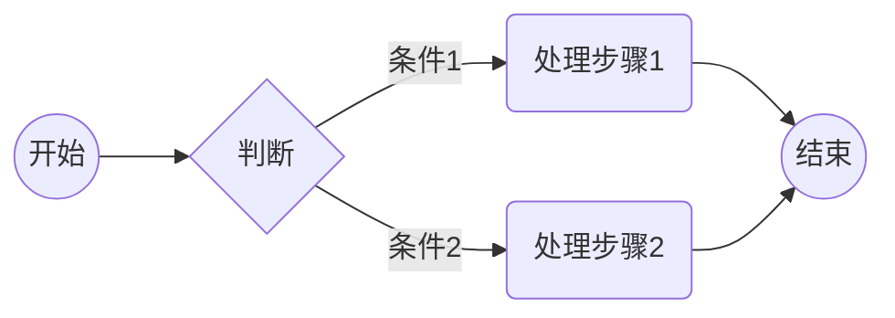
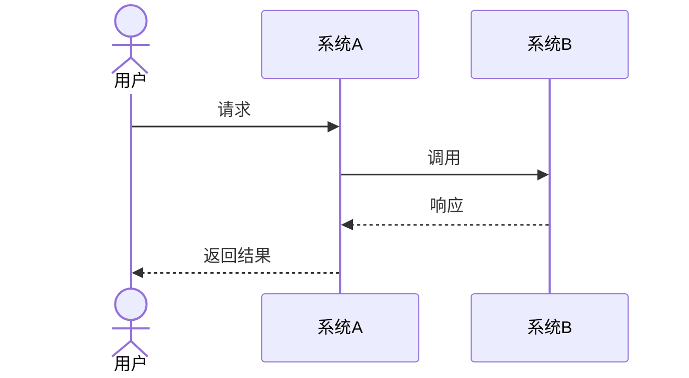
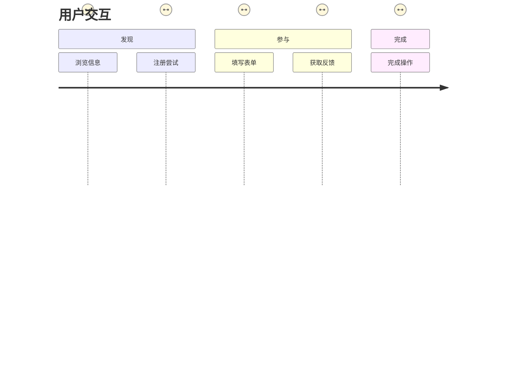
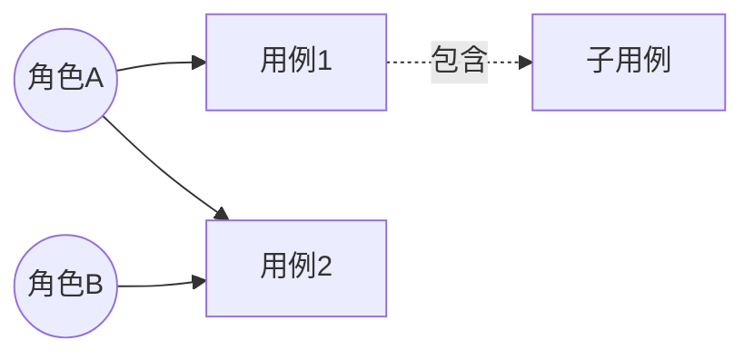
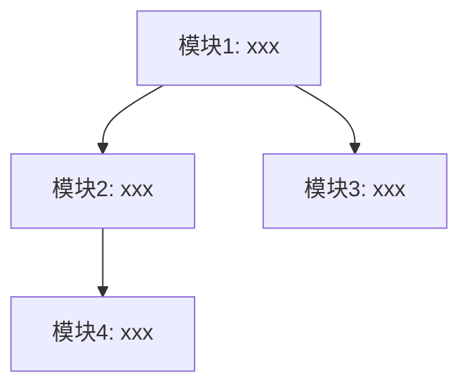

---
```
id: "PRD-{REQUIREMENT-ID}-MVP{N}"
title: "{产品需求标题}"
version: "1.0.0"
status: "draft"
created: "{YYYY-MM-DD}"
updated: "{YYYY-MM-DD}"
author: "product-designer"
reviewers: []
parent: "REQUIREMENT-{对应需求分析编号}"
mvp_phase: "MVP-{N}"
tags: []
```
---

# {产品需求标题}

## 1. 产品概述

### 1.1 产品目标
<!-- 本MVP的核心交付目标 -->
- 关联需求分析：`analysis/REQUIREMENT-{ID}.md`
- MVP阶段：MVP-{N}

### 1.2 需求范围
<!-- 本MVP的功能范围 -->

### 1.3 涉及角色

| 角色 | 描述 | 相关用例 |
| ----- | ------ | --------- |
| | | |

## 2. 业务流程

### 2.1 核心业务流程



#### 流程步骤说明

| 步骤 | 参与角色 | 输入 | 处理逻辑 | 输出 | 业务规则 |
| ---- | -------- | ---- | -------- | ---- | -------- |
| 1    |          |      |          |      | BR-xxx   |

### 2.2 分支异常流程

#### 异常场景清单

| 异常编号 | 异常描述 | 触发条件 | 处理方式 | 用户提示 |
| -------- | -------- | -------- | -------- | -------- |
| EX-001   |          |          |          |          |

### 2.3 系统交互流程



## 3. 产品交互

### 3.1 用户交互流程





### 3.2 产品交互设计

<!-- 界面结构、交互过程、关键页面/流程的交互说明、控件与反馈、无障碍与多端适配等 -->

交互原型：[XX交互设计](http://www.google.com)

| 交互场景     | 交互方式/控件     | 反馈与提示     | 备注 |
| ------------ | ----------------- | -------------- | ---- |
|              |                   |                |      |


## 4. 用户故事

### 4.1 用户故事清单

| 故事编号 | 用户故事                             | 优先级 | 故事点 | 关联需求 |
| -------- | ------------------------------------ | ------ | ------ | -------- |
| US-001   | 作为{角色}，我希望{功能}，以便{价值} | P0     |        | FR-001   |

### 4.2 用户故事详述

#### US-001: {故事标题}

**用户故事**：

> 作为{角色}，我希望{功能}，以便{价值}

**验收标准**：

```gherkin
场景1: {场景名称}
  假设 {前置条件}
  当 {触发动作}
  那么 {预期结果}

场景2: {异常场景名称}
  假设 {前置条件}
  当 {触发动作}
  那么 {预期结果}
```

**补充说明**：

- 业务规则：BR-xxx
- 界面要求：（如有）
- 性能要求：（如有）

<!-- 按此格式逐一描述每个用户故事 -->

## 5. 用例模型

### 5.1 用例图



### 5.2 用例详述

#### UC-001: {用例名称}

| 项目         | 描述   |
| ------------ | ------ |
| **用例编号** | UC-001 |
| **用例名称** |        |
| **参与者**   |        |
| **前置条件** |        |
| **后置条件** |        |
| **触发条件** |        |

**主成功场景**：

1.  
2.  
3.  

**扩展场景**：

- 2a. {异常条件}：
  1.  
  2.  

**业务规则**：

- BR-xxx: {规则描述}

## 6. 功能模块设计

### 6.1 功能模块划分



### 6.2 模块详述

#### 模块1: {模块名称}

- **职责**：
- **包含功能**：US-001, US-002
- **输入**：
- **输出**：
- **依赖模块**：

## 7. 业务规则汇总

| 规则编号 | 规则名称 | 触发条件 | 执行逻辑 | 异常处理 | 优先级 | 关联用例 |
| -------- | -------- | -------- | -------- | -------- | ------ | -------- |
| BR-001   |          |          |          |          |        | UC-001   |

## 8. 数据字典

### 8.1 业务术语

| 术语 | 定义 | 示例 | 备注 |
| ---- | ---- | ---- | ---- |
|      |      |      |      |

### 8.2 状态定义

| 实体 | 状态 | 说明 | 可流转状态 |
| ---- | ---- | ---- | ---------- |
|      |      |      |            |

## 9. 验收标准汇总

### 9.1 功能验收标准

| 编号   | 验收项 | 验收条件 | 关联故事 |
| ------ | ------ | -------- | -------- |
| AC-001 |        |          | US-001   |

### 9.2 非功能验收标准

| 编号    | 验收项 | 验收条件 |
| ------- | ------ | -------- |
| NAC-001 |        |          |

## 10. 附录

### 10.1 原型/线框图

<!-- 如有界面设计，附上原型链接或线框图 -->

### 10.2 变更历史

| 版本  | 日期 | 变更说明 | 作者             |
| ----- | ---- | -------- | ---------------- |
| 1.0.0 |      | 初始版本 | product-designer |

### 10.3 质量自查表 (Self-Check)

<!-- 在提交评审前，请根据以下自查项逐一核查文档质量 -->

- [ ] **完整性**：各核心部分内容齐全，字段填充完备，重要信息无遗漏。
- [ ] **一致性**：与解决方案、需求分析文档、相关规约文件等保持一致，无明显冲突。
- [ ] **可追溯性**：功能需求、业务规则及验收标准均可追溯至需求分析与业务目标。
- [ ] **可实现性**：需求描述清晰，具备明确的可开发性与可测试性。
- [ ] **优先级明确**：交付拆分合理，优先级和依赖关系明晰。
- [ ] **风险识别**：已充分识别关键依赖和主要风险，列明应对建议。
- [ ] **术语清晰**：术语及数据字典完整、引用规范。
- [ ] **格式规范**：表格、编号、结构、用词等格式规范，便于查阅和维护。
