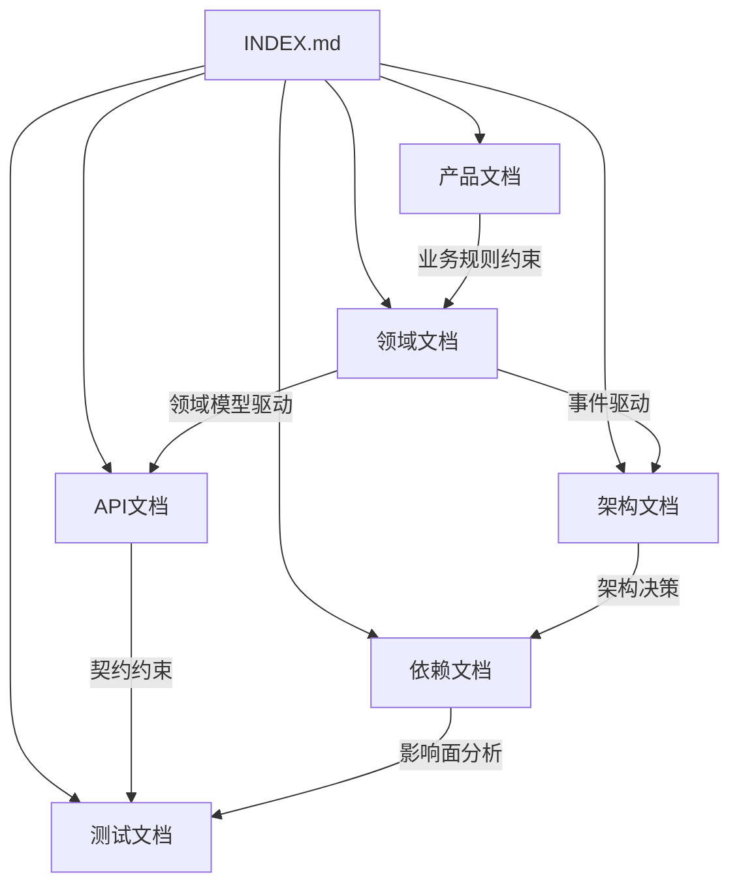

# 系统说明文档索引
> 这是 AI Agent 阅读本系统文档的入口文件。更新任何文档后，必须同步更新本索引。

## 元信息

| 属性 | 值 |
|------|-----|
| 系统名称 | {system-name} |
| 当前版本 | v{x.y.z} |
| 最后更新 | {YYYY-MM-DD} |
| 维护团队 | {team-name} |

## 快速导航

### 我想了解系统是做什么的

- [产品概览](docs/instructions/product/PRODUCT-OVERVIEW.md)
- [功能地图](docs/instructions/product/FEATURE-MAP.md)
- [用户旅程](docs/instructions/product/USER-JOURNEY.md)
- [用户故事](docs/instructions/product/USER-STORIES.md)

### 我想了解业务规则和约束

- [业务规则清单](docs/instructions/product/BUSINESS-RULES.md)
- [业务约束与不变量](docs/instructions/product/CONSTRAINTS.md)
- [统一术语表](docs/instructions/GLOSSARY.md)

### 我想了解系统怎么构建的

- [系统架构](docs/instructions/architecture/SYSTEM-ARCHITECTURE.md)
- [数据架构](docs/instructions/architecture/DATA-ARCHITECTURE.md)
- [领域模型](docs/instructions/domain/DOMAIN-MODEL.md)
- [限界上下文](docs/instructions/domain/BOUNDED-CONTEXTS.md)

### 我想了解模块间如何交互

- [集成关系图](docs/instructions/architecture/INTEGRATION-MAP.md)
- [上下文映射](docs/instructions/domain/CONTEXT-MAPPING.md)
- [领域事件目录](docs/instructions/domain/DOMAIN-EVENTS.md)
- [API总览](docs/instructions/api/API-OVERVIEW.md)

### 我想评估变更的影响面

- [模块依赖矩阵](docs/instructions/dependency/DEPENDENCY-MATRIX.md)
- [变更风险地图](docs/instructions/dependency/CHANGE-RISK-MAP.md)
- [影响面分析指南](docs/instructions/dependency/IMPACT-ANALYSIS-GUIDE.md)

### 我想了解测试情况

- [测试策略](docs/instructions/test/TEST-STRATEGY.md)
- [测试覆盖报告](docs/instructions/test/TEST-COVERAGE.md)

## 文档关系图

## 文档分类表

| 分类 | 路径 | 说明 |
| ------ | ------ | ------ |
| 产品 | [product/](docs/instructions/product/) | 产品概览、功能地图、用户旅程、业务规则、约束、用户指南 |
| 架构 | [architecture/](docs/instructions/architecture/) | 系统/数据/部署架构、集成关系、架构决策记录 |
| 领域 | [domain/](docs/instructions/domain/) | 领域模型总览、限界上下文、领域事件、上下文映射 |
| API | [api/](docs/instructions/api/) | API 总览、设计约定、各服务 API 规约与契约 |
| 依赖与影响面 | [dependency/](docs/instructions/dependency/) | 依赖矩阵、影响面分析、变更风险地图 |
| 测试 | [test/](docs/instructions/test/) | 测试策略、覆盖报告、功能域测试场景 |

## 文档更新规则

1. 新增功能：更新 FEATURE-MAP → BUSINESS-RULES → DOMAIN-MODEL → API-SPEC → TEST-CASES → DEPENDENCY-MATRIX
2. 修改业务规则：更新 BUSINESS-RULES → CONSTRAINTS → 受影响的 API-SPEC → TEST-CASES
3. 架构变更：新增 ADR → 更新 SYSTEM-ARCHITECTURE → INTEGRATION-MAP → DEPENDENCY-MATRIX
4. 所有变更：更新 CHANGELOG.md
