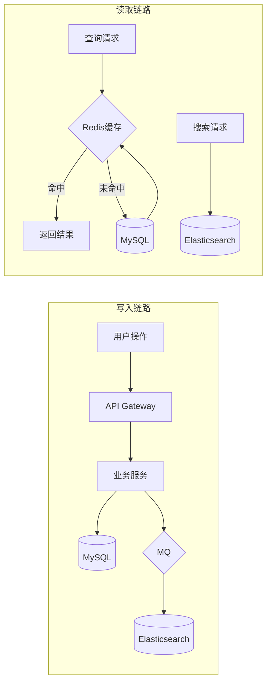

# 数据架构

## 元信息

| 属性 | 值 |
|------|-----|
| 最后更新 | {YYYY-MM-DD} |
| 关联文档 | [领域模型](docs/instructions/domain/DOMAIN-MODEL.md), [系统架构](docs/instructions/architecture/SYSTEM-ARCHITECTURE.md) |

## 数据存储全景

| 存储 | 类型 | 用途 | 所属服务 | 数据量级 |
|------|------|------|---------|---------|
| user_db | MySQL | 用户数据 | svc-user | ~100万行 |
| product_db | MySQL | 商品数据 | svc-product | ~500万行 |
| order_db | MySQL | 订单数据 | svc-order | ~2000万行/年 |
| inventory_db | MySQL | 库存数据 | svc-inventory | ~500万行 |
| payment_db | MySQL | 支付数据 | svc-payment | ~2000万行/年 |
| redis-cluster | Redis | 缓存/会话/分布式锁 | 共享 | - |
| es-cluster | Elasticsearch | 商品搜索索引 | svc-product | ~500万文档 |
| oss | 对象存储 | 图片/文件 | 共享 | ~500GB |

## 核心表结构

### 用户库 (user_db)

#### users 表
| 字段 | 类型 | 约束 | 说明 |
|------|------|------|------|
| id | BIGINT | PK, AUTO_INCREMENT | 用户ID |
| phone | VARCHAR(20) | UNIQUE, NOT NULL | 手机号 |
| email | VARCHAR(100) | UNIQUE | 邮箱 |
| password_hash | VARCHAR(255) | NOT NULL | 密码哈希(bcrypt) |
| nickname | VARCHAR(50) | | 昵称 |
| avatar_url | VARCHAR(500) | | 头像URL |
| status | TINYINT | NOT NULL, DEFAULT 1 | 1:正常 2:冻结 3:注销 |
| created_at | DATETIME | NOT NULL | 创建时间 |
| updated_at | DATETIME | NOT NULL | 更新时间 |
| deleted_at | DATETIME | | 软删除标记 |

**索引**:
- `uk_phone` UNIQUE (phone)
- `uk_email` UNIQUE (email)
- `idx_created_at` (created_at)

### 订单库 (order_db)

#### orders 表
| 字段 | 类型 | 约束 | 说明 |
|------|------|------|------|
| id | BIGINT | PK, AUTO_INCREMENT | 订单ID |
| order_no | VARCHAR(32) | UNIQUE, NOT NULL | 订单编号 |
| user_id | BIGINT | NOT NULL | 用户ID |
| status | VARCHAR(20) | NOT NULL | 订单状态(见INV-002) |
| total_amount | BIGINT | NOT NULL | 订单总额(分) |
| discount_amount | BIGINT | NOT NULL, DEFAULT 0 | 优惠金额(分) |
| shipping_amount | BIGINT | NOT NULL, DEFAULT 0 | 运费(分) |
| pay_amount | BIGINT | NOT NULL | 应付金额(分) |
| paid_at | DATETIME | | 支付时间 |
| shipping_address | JSON | NOT NULL | 收货地址快照 |
| created_at | DATETIME | NOT NULL | 创建时间 |
| updated_at | DATETIME | NOT NULL | 更新时间 |
| deleted_at | DATETIME | | 软删除标记 |

**索引**:
- `uk_order_no` UNIQUE (order_no)
- `idx_user_id_created_at` (user_id, created_at)
- `idx_status` (status)

#### order_items 表
| 字段 | 类型 | 约束 | 说明 |
|------|------|------|------|
| id | BIGINT | PK, AUTO_INCREMENT | 订单项ID |
| order_id | BIGINT | NOT NULL | 订单ID |
| product_id | BIGINT | NOT NULL | 商品ID |
| sku_code | VARCHAR(50) | NOT NULL | SKU编码 |
| product_name | VARCHAR(200) | NOT NULL | 商品名称(快照) |
| unit_price | BIGINT | NOT NULL | 单价(分)(快照) |
| quantity | INT | NOT NULL | 数量 |
| subtotal | BIGINT | NOT NULL | 小计(分) |

**索引**:
- `idx_order_id` (order_id)

> 其他表结构类似，按需补充

## 数据流转图

## 缓存策略

| 缓存Key模式             | 数据来源            | 过期时间            | 更新策略                   | 说明                 |
| ----------------------- | ------------------- | ------------------- | -------------------------- | -------------------- |
| `user:{id}`             | user_db.users       | 30min               | Cache-Aside                | 用户基本信息         |
| `product:{id}`          | product_db.products | 10min               | Cache-Aside + 变更事件失效 | 商品详情             |
| `inventory:{sku}`       | inventory_db        | 不过期              | Write-Through              | 库存数量（高频读写） |
| `token:blacklist:{jti}` | -                   | 与Token过期时间一致 | 写入即生效                 | Token黑名单          |

## 数据分片策略

| 表          | 分片方式     | 分片键       | 分片数 | 触发条件                 |
| ----------- | ------------ | ------------ | ------ | ------------------------ |
| orders      | 按用户ID哈希 | user_id      | 16     | 单表超过5000万行(PC-004) |
| order_items | 跟随orders   | order_id关联 | 16     | 与orders同步分片         |

## 数据备份与恢复

| 数据库        | 备份方式    | 频率              | 保留期 | RTO    | RPO    |
| ------------- | ----------- | ----------------- | ------ | ------ | ------ |
| MySQL         | 全量+Binlog | 全量:日/增量:实时 | 30天   | 1小时  | 5分钟  |
| Redis         | RDB + AOF   | RDB:小时/AOF:秒级 | 7天    | 10分钟 | 1秒    |
| Elasticsearch | Snapshot    | 日                | 7天    | 2小时  | 24小时 |

