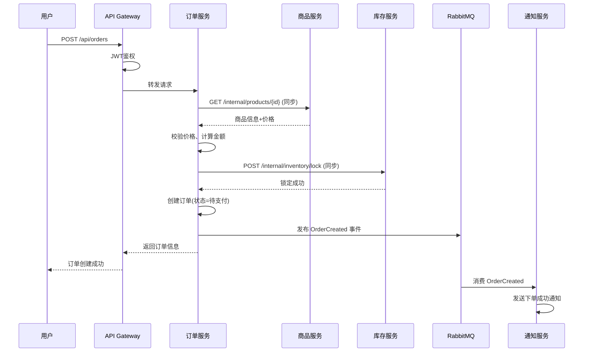
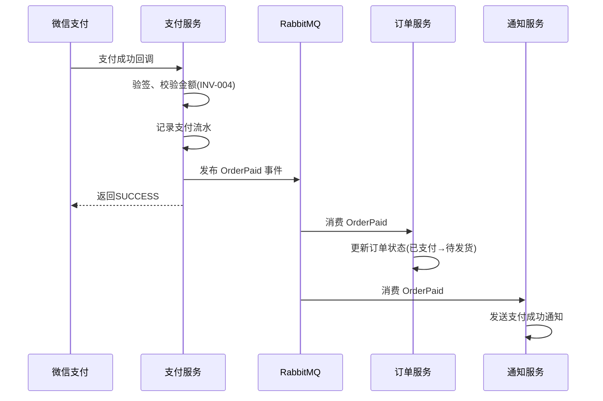

# 集成关系图

## 元信息

| 属性 | 值 |
|------|-----|
| 最后更新 | {YYYY-MM-DD} |
| 关联文档 | [系统架构](docs/instructions/architecture/SYSTEM-ARCHITECTURE.md), [依赖矩阵](docs/instructions/dependency/DEPENDENCY-MATRIX.md) |

## 使用说明

> AI Agent 在评估变更影响面时，此文档是核心参考。
> 它描述了所有服务间的调用关系、数据流向和事件传播路径。

## 服务间同步调用

| 调用方 | 被调用方 | 接口 | 调用方式 | 超时 | 降级策略 | 使用场景 |
|--------|---------|------|---------|------|---------|---------|
| svc-order | svc-product | GET /internal/products/{id} | HTTP/REST | 3s | 使用本地缓存 | 订单创建时获取商品信息 |
| svc-order | svc-inventory | POST /internal/inventory/lock | HTTP/REST | 5s | 失败则订单创建失败 | 订单创建时锁定库存 |
| svc-order | svc-user | GET /internal/users/{id}/address | HTTP/REST | 3s | 使用订单中的地址快照 | 获取用户收货地址 |
| svc-payment | svc-order | PUT /internal/orders/{id}/status | HTTP/REST | 5s | 重试3次后进入补偿队列 | 支付成功后更新订单状态 |

## 服务间异步事件

| 事件名称 | 事件ID | 发布方 | 消费方 | 消息队列 | 可靠性保证 | 使用场景 |
|---------|--------|--------|--------|---------|-----------|---------|
| OrderCreated | EVT-001 | svc-order | svc-notification | RabbitMQ:order.events | 至少一次 | 发送下单成功通知 |
| OrderPaid | EVT-002 | svc-payment | svc-order, svc-notification | RabbitMQ:payment.events | 至少一次 | 更新订单状态、发送支付成功通知 |
| OrderCancelled | EVT-003 | svc-order | svc-inventory, svc-notification | RabbitMQ:order.events | 至少一次 | 释放库存、发送取消通知 |
| OrderShipped | EVT-004 | svc-order | svc-notification | RabbitMQ:order.events | 至少一次 | 发送发货通知 |
| PaymentRefunded | EVT-005 | svc-payment | svc-order, svc-inventory | RabbitMQ:payment.events | 至少一次 | 更新订单为已退款、释放库存 |
| InventoryLow | EVT-006 | svc-inventory | svc-notification | RabbitMQ:inventory.events | 最多一次 | 库存低于阈值告警 |
| UserRegistered | EVT-007 | svc-user | svc-notification | RabbitMQ:user.events | 至少一次 | 发送注册欢迎通知 |
| ProductUpdated | EVT-008 | svc-product | svc-order | RabbitMQ:product.events | 至少一次 | 同步更新ES搜索索引 |

## 事件格式规范

所有异步事件遵循统一信封格式：

```json
{
  "eventId": "evt-uuid-001",
  "eventType": "OrderCreated",
  "timestamp": "2024-01-15T10:30:00Z",
  "source": "svc-order",
  "version": "1.0",
  "traceId": "trace-abc-123",
  "payload": {
    "orderId": 100001,
    "orderNo": "ORD20240115103000001",
    "userId": 50001,
    "totalAmount": 9900
  }
}
```

## 外部系统集成

| 外部系统   | 集成方向        | 集成方式   | 对接服务         | 用途                     | SLA    |
| ---------- | --------------- | ---------- | ---------------- | ------------------------ | ------ |
| 微信支付   | 出站 + 入站回调 | HTTPS REST | svc-payment      | 支付下单、支付回调、退款 | 99.99% |
| 支付宝     | 出站 + 入站回调 | HTTPS REST | svc-payment      | 支付下单、支付回调、退款 | 99.99% |
| 阿里云短信 | 出站            | HTTPS SDK  | svc-notification | 发送短信验证码、通知     | 99.95% |
| 快递100    | 出站            | HTTPS REST | svc-order        | 物流轨迹查询             | 99.9%  |
| 微信公众号 | 出站            | HTTPS REST | svc-notification | 模板消息推送             | 99.9%  |

## 调用链路图（核心场景）

### 场景：用户下单



### 场景：支付完成



## 集成健壮性设计

| 机制     | 适用场景           | 实现方式                    | 配置                            |
| -------- | ------------------ | --------------------------- | ------------------------------- |
| 超时控制 | 所有同步调用       | HTTP Client超时             | 连接超时1s，读超时3-5s          |
| 重试     | 幂等性接口         | Spring Retry                | 最多3次，指数退避(1s,2s,4s)     |
| 熔断     | 所有同步调用       | Resilience4j CircuitBreaker | 失败率>50%开启，60s后半开       |
| 降级     | 非核心依赖         | Fallback方法                | 返回缓存数据或默认值            |
| 幂等性   | 事件消费、支付回调 | 唯一ID + 去重表             | 基于eventId/outTradeNo去重      |
| 死信队列 | 消费失败的消息     | RabbitMQ DLX                | 重试3次后进入死信队列，人工处理 |

