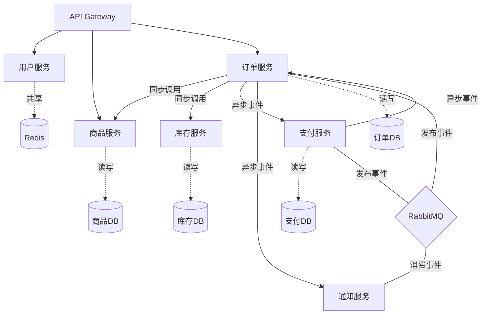

# 系统架构

## 元信息

| 属性 | 值 |
|------|-----|
| 最后更新 | {YYYY-MM-DD} |
| 架构风格 | 微服务 / 单体 / 模块化单体 |
| 关联文档 | [集成关系图](docs/instructions/architecture/INTEGRATION-MAP.md), [部署架构](docs/instructions/architecture/DEPLOYMENT-ARCHITECTURE.md), [架构决策记录](docs/instructions/architecture/DECISION-RECORDS/) |

## 架构概览

### 架构分层

```
┌─────────────────────────────────────────────┐
│                  接入层                       │
│  (API Gateway / Nginx / CDN)                │
├─────────────────────────────────────────────┤
│                  应用层                       │
│  ┌──────┐ ┌──────┐ ┌──────┐ ┌──────┐      │
│  │用户服务│ │商品服务│ │订单服务│ │支付服务│      │
│  └──────┘ └──────┘ └──────┘ └──────┘      │
├─────────────────────────────────────────────┤
│                  基础设施层                    │
│  (消息队列 / 缓存 / 数据库 / 对象存储)         │
└─────────────────────────────────────────────┘
```

### 服务清单

| 服务名称 | 服务ID | 职责描述 | 技术栈 | 所属上下文 | 代码位置 |
|---------|--------|---------|--------|-----------|---------|
| 用户服务 | svc-user | 用户注册、登录、信息管理 | Java 17 + Spring Boot 3.2 | 用户上下文 | /services/user-service |
| 商品服务 | svc-product | 商品CRUD、SKU管理、分类管理 | Java 17 + Spring Boot 3.2 | 商品上下文 | /services/product-service |
| 订单服务 | svc-order | 订单创建、状态管理、订单查询 | Java 17 + Spring Boot 3.2 | 订单上下文 | /services/order-service |
| 支付服务 | svc-payment | 支付发起、回调处理、退款 | Java 17 + Spring Boot 3.2 | 支付上下文 | /services/payment-service |
| 库存服务 | svc-inventory | 库存管理、库存锁定与释放 | Java 17 + Spring Boot 3.2 | 库存上下文 | /services/inventory-service |
| 通知服务 | svc-notification | 短信、邮件、站内信 | Java 17 + Spring Boot 3.2 | 通知上下文 | /services/notification-service |

### 服务交互总览



## 技术栈

### 运行时

| 类别     | 技术选型             | 版本  | 选型原因             |
| -------- | -------------------- | ----- | -------------------- |
| 语言     | Java                 | 17    | LTS版本，团队技术栈  |
| 框架     | Spring Boot          | 3.2.x | 生态成熟             |
| 数据库   | MySQL                | 8.0   | 关系型数据，事务支持 |
| 缓存     | Redis                | 7.x   | 高性能缓存，分布式锁 |
| 消息队列 | RabbitMQ             | 3.12  | 可靠消息投递         |
| 搜索     | Elasticsearch        | 8.x   | 商品搜索             |
| 网关     | Spring Cloud Gateway | 4.x   | 统一路由、鉴权       |

### 开发与部署

| 类别     | 技术选型             | 说明           |
| -------- | -------------------- | -------------- |
| 构建工具 | Maven                | 多模块管理     |
| 容器化   | Docker               | 标准化部署     |
| 编排     | Kubernetes           | 生产环境编排   |
| CI/CD    | GitHub Actions       | 自动化构建部署 |
| 监控     | Prometheus + Grafana | 指标采集与展示 |
| 链路追踪 | SkyWalking           | 分布式链路追踪 |
| 日志     | ELK Stack            | 集中式日志     |

## 横切关注点

### 鉴权方案

- 方式：JWT Token
- 签发：用户服务签发，Gateway统一验证
- 刷新：Access Token 2h，Refresh Token 7d
- 详见 [ADR-001](docs/instructions/architecture/DECISION-RECORDS/ADR-001-jwt-authentication.md)

### 异常处理

- 统一异常响应格式：

  ```json
  {
    "code": "ORDER_001",
    "message": "库存不足",
    "details": { "sku": "SKU-123", "requested": 5, "available": 2 },
    "traceId": "abc-123-def"
  }
  ```

- 错误码规范：`{服务缩写}_{三位数字}`

### 分布式事务

- 策略：优先使用最终一致性（Saga模式）
- 订单创建流程采用编排式Saga
- 详见 [ADR-003](docs/instructions/architecture/DECISION-RECORDS/ADR-003-saga-pattern.md)