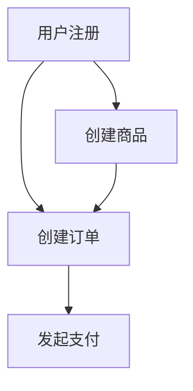

# 功能地图

## 元信息

| 属性 | 值 |
|------|-----|
| 最后更新 | {YYYY-MM-DD} |
| 关联文档 | [产品概览](docs/instructions/product/PRODUCT-OVERVIEW.md), [业务规则](docs/instructions/product/BUSINESS-RULES.md) |

## 功能全景

> 使用 功能域 → 功能模块 → 功能点 三级结构组织

### 功能域：用户管理 (F-USER)

| 功能模块 | 功能点ID | 功能点 | 状态 | 关联业务规则 | 关联API | 所属上下文 |
|---------|---------|--------|------|------------|---------|-----------|
| 注册登录 | F-USER-001 | 手机号注册 | ✅已上线 | BR-001, BR-002 | POST /api/v1/users/register | 用户上下文 |
| 注册登录 | F-USER-002 | 邮箱注册 | ✅已上线 | BR-001, BR-003 | POST /api/v1/users/register | 用户上下文 |
| 注册登录 | F-USER-003 | 第三方登录 | 🚧开发中 | BR-004 | POST /api/v1/users/oauth | 用户上下文 |
| 个人信息 | F-USER-010 | 修改头像 | ✅已上线 | BR-010 | PUT /api/v1/users/avatar | 用户上下文 |

### 功能域：商品管理 (F-PRODUCT)

| 功能模块 | 功能点ID | 功能点 | 状态 | 关联业务规则 | 关联API | 所属上下文 |
|---------|---------|--------|------|------------|---------|-----------|
| 商品发布 | F-PROD-001 | 创建商品 | ✅已上线 | BR-020, BR-021 | POST /api/v1/products | 商品上下文 |
| ... | ... | ... | ... | ... | ... | ... |

## 功能状态统计

| 状态 | 数量 | 占比 |
|------|------|------|
| ✅已上线 | 45 | 75% |
| 🚧开发中 | 10 | 17% |
| 📋已规划 | 5 | 8% |

## 功能依赖关系

