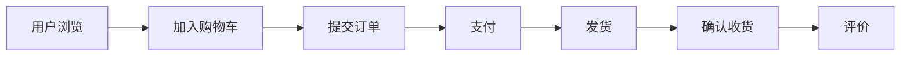

# 产品概览

## 元信息

| 属性 | 值 |
|------|-----|
| 文档版本 | v{x.y} |
| 最后更新 | {YYYY-MM-DD} |
| 关联文档 | [功能地图](docs/instructions/product/FEATURE-MAP.md), [用户旅程](docs/instructions/product/USER-JOURNEY.md) |

## 产品定位

### 一句话描述
{用一句话说清楚这个系统是什么、为谁服务、解决什么问题}

### 目标用户
| 用户角色 | 描述 | 核心诉求 |
|---------|------|---------|
| 普通消费者 | 通过App/Web购物的终端用户 | 快速找到商品、顺畅完成购买 |
| 商家 | 在平台上售卖商品的B端用户 | 高效管理商品和订单 |
| 运营人员 | 平台内部运营团队 | 活动配置、数据分析 |

### 产品价值主张
1. {核心价值1}
2. {核心价值2}
3. {核心价值3}

## 系统边界

### 本系统负责
- ✅ {职责1}
- ✅ {职责2}

### 本系统不负责
- ❌ {排除项1}（由{外部系统A}负责）
- ❌ {排除项2}（由{外部系统B}负责）

### 外部系统依赖
| 外部系统 | 交互方式 | 用途 | 是否强依赖 |
|---------|---------|------|-----------|
| 支付网关 | REST API | 处理支付 | 是 |
| 短信服务 | MQ | 发送通知 | 否（降级为邮件） |

## 核心业务流程

> 详细流程见 [用户旅程地图](docs/instructions/product/USER-JOURNEY.md)
