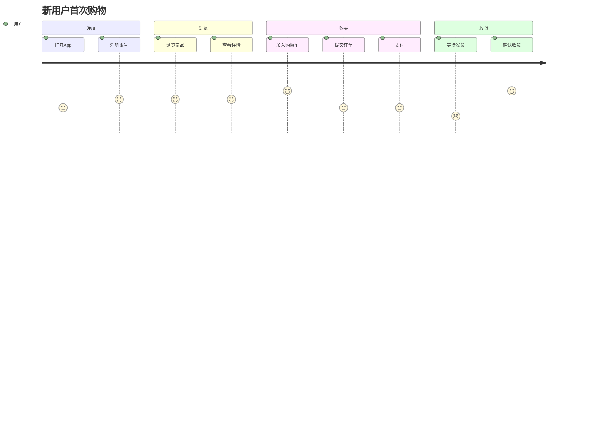

# 用户旅程地图

## 元信息

| 属性 | 值 |
|------|-----|
| 最后更新 | {YYYY-MM-DD} |
| 关联文档 | [功能地图](docs/instructions/product/FEATURE-MAP.md), [业务规则](docs/instructions/product/BUSINESS-RULES.md) |

## 旅程列表

### UJ-001: 新用户首次购物

**角色**: 普通消费者
**前置条件**: 用户未注册
**目标**: 完成第一次购物

| 步骤 | 用户行为 | 系统响应 | 触发功能点 | 触发业务规则 | 异常场景 |
|------|---------|---------|-----------|------------|---------|
| 1 | 打开App | 展示首页推荐 | F-REC-001 | - | 推荐服务不可用→展示默认列表 |
| 2 | 点击注册 | 展示注册表单 | F-USER-001 | BR-001 | - |
| 3 | 输入手机号，获取验证码 | 发送短信验证码 | F-USER-001 | BR-002: 60秒内不可重发 | 短信发送失败→提示稍后重试 |
| 4 | 输入验证码，完成注册 | 创建账号，自动登录 | F-USER-001 | BR-003: 验证码5分钟有效 | 验证码错误→提示重新输入 |
| 5 | 浏览商品列表 | 展示商品列表 | F-PROD-010 | - | - |
| 6 | 点击商品详情 | 展示商品详情页 | F-PROD-011 | BR-020: 下架商品不可查看 | 商品已下架→提示已下架 |
| 7 | 加入购物车 | 添加到购物车 | F-CART-001 | BR-030: 单商品限购数量 | 超过限购→提示限购 |
| 8 | 提交订单 | 创建订单，锁定库存 | F-ORDER-001 | BR-040, BR-041 | 库存不足→提示库存不足 |
| 9 | 选择支付方式，支付 | 调用支付网关 | F-PAY-001 | BR-050: 30分钟内未支付自动取消 | 支付失败→可重试 |
| 10 | 支付成功 | 更新订单状态，通知商家 | F-ORDER-002 | BR-051 | - |

### UJ-002: 商家发布商品

...